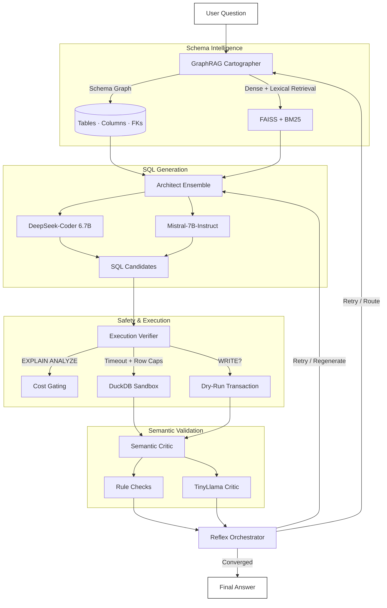

# Axiom SQL-Reflex v4  
[](benchmarks/)
[](setup/)

### Execution-Aware, Multi-Agent Text-to-SQL System with Semantic Validation


> A research-grade, end-to-end autonomous Text-to-SQL agent demonstrating how correctness emerges through execution, feedback, and semantic reasoning — not just prompting.

Built by **Axiom AI Studio (QwikZen)**

---

## Overview

**Axiom SQL-Reflex v4** is an advanced multi-agent system for converting natural language questions into safe, correct, and executable SQL queries over real databases.

Unlike toy demos, this project focuses on:

- Real database schemas (Spider + BIRD datasets)  
- Execution-grounded validation  
- Semantic correctness (not just syntax)  
- Multi-model LLM orchestration  
- Robust evaluation with transparent metrics  
- Safe handling of WRITE operations  
- Research-style experimentation and benchmarking  

This project is designed to reflect **how modern AI agent systems are actually built and evaluated in industry and research labs**.

---

## Core Contributions

Axiom SQL-Reflex v4 demonstrates a complete agentic architecture including:

### 1. Schema Intelligence (GraphRAG Cartographer)
- Builds schema graphs from real SQLite databases  
- Extracts tables, columns, and foreign keys  
- Uses:
  - FAISS dense retrieval  
  - BM25 lexical reranking  
  - Graph k-hop expansion  
- Supports join-path discovery and ambiguity detection  

Result:  
> The model is grounded in real schema structure instead of hallucinating tables.

---

### 2. Multi-Model Architect (LLM Ensemble)
SQL generation is performed using an **ensemble of local models**:

- DeepSeek-Coder 6.7B (primary generator)  
- Mistral-7B-Instruct (diverse candidate generator)  
- TinyLlama-1.1B (used in critics)  

Each candidate SQL is:
- Schema-validated  
- Intent-classified (READ vs WRITE)  
- Output-shape analyzed  
- Deduplicated  

This mimics **self-consistency and hypothesis search** used in modern reasoning systems.

---

### 3. Execution Verifier (Safety + Cost Control)
Before any SQL is accepted, it passes through:

- `EXPLAIN ANALYZE` cost inspection  
- Row-count estimation  
- Execution timeout enforcement  
- Dry-run simulation for WRITE queries  
- Resource caps (latency + output size)  

This prevents:
- Expensive runaway queries  
- Dangerous SQL behavior  
- Non-terminating execution  

---

### 4. Semantic Verifier (LLM Critic + Rule Checks)

Beyond execution correctness, the system checks:

- Does the result logically answer the question?  
- Are metrics aligned (COUNT, AVG, MAX, etc.)?  
- Are results empty or nonsensical?  

This is implemented using:
- Rule-based sanity checks  
- A local LLM critic producing structured JSON verdicts  

This moves evaluation from:
> “Did it run?”  
to  
> “Is the answer actually correct?”

---

### 5. Reflex Orchestrator (Agent Loop)
The system uses an iterative reasoning loop:

1. Cartographer grounds schema  
2. Architect proposes SQL candidates  
3. Verifier executes safely  
4. Critic validates semantics  
5. System retries on failure with fresh context  

The loop stops when:
- A high-confidence valid solution is found  
- Or retry budget is exhausted  

This is **true agentic behavior**, not single-shot prompting.

---

### 6. Safe WRITE Operations Pipeline
v4 also implements controlled WRITE query handling:

- Role-based access control (RBAC)  
- Schema-impact simulation  
- Destructive operation blocking  
- Dry-run execution  
- LLM semantic audit for WRITE intent  
- No-op update detection  

This demonstrates how LLM agents can safely interact with real databases.

---

## Architecture



User Question

↓

Cartographer (GraphRAG Schema Reasoning)

↓

Architect (Multi-LLM SQL Generator)

↓

Execution Verifier (Cost + Timeout + Safety)

↓

Semantic Critic (LLM + Rule Validation)

↓

Reflex Orchestrator (Retries + Convergence)

↓

Final Answer


Each agent is modular and independently testable.

---

## Benchmarks & Evaluation

All evaluations are **execution-grounded**, not string-match based.

### Single-DB Evaluation (Spider: concert_singer)

- Questions: 45  
- Accuracy: **~55.6%**  
- Avg time per query: ~24.7s  
- Models: DeepSeek-Coder 6.7B + Mistral 7B  
- No fine-tuning, fully local inference  

This validates:
> The system can reason effectively within a fixed schema.

---

### Cross-DB Evaluation (Spider dev, 100 mixed questions)

- Databases: multiple unseen schemas  
- Accuracy: **34%**  
- Avg time per query: ~36s  
- Fully zero-shot across schemas  

Outcome distribution:
- Correct: 34  
- Wrong logic: 32  
- Gold invalid (dataset noise): 34  

This reflects **honest, real-world generalization performance** for small open models.

For reference:
- Naive prompting: 10–25%  
- Strong prompting systems: 25–40%  
- Fine-tuned research systems: 50–70%  

This places Axiom SQL-Reflex v4 in the **serious applied systems category**.

---

## What This Project Demonstrates

This project showcases competence in:

- LLM systems architecture  
- Retrieval-augmented reasoning  
- Graph modeling (NetworkX)  
- Vector search (FAISS)  
- Transformers integration  
- Local model inference (llama.cpp)  
- Benchmark engineering  
- Safe execution systems  
- Evaluation methodology  
- Agentic loop design  

This is **not a demo project**.  
It is an applied research system.

---

## Tech Stack

- Python  
- DuckDB + SQLite  
- llama.cpp (local inference)  
- HuggingFace Transformers  
- FAISS  
- NetworkX  
- Sentence-Transformers  
- Pandas / NumPy  
- Spider + BIRD datasets  

No external APIs required.

---

## How to Run (High Level)

> Full reproducible setup instructions can be added depending on how you want to publish.

Typical flow:

1. Build schema artifacts  
2. Load LLMs locally  
3. Run reflex orchestrator  
4. Evaluate using benchmark notebooks  

The project is modular under `/agents/`:
- `cartographer.py`  
- `architect.py`  
- `verifier.py`  
- `critic.py`  
- `orchestrator.py`  
- `schema_registry.py`  

---

## Limitations (Honest)

This project intentionally documents limitations:

- No fine-tuning (pure inference)  
- Limited by local model capabilities (6–7B range)  
- Latency is high due to multi-agent loops  
- Cross-DB generalization remains challenging  
- Semantic critic occasionally unreliable (small model)  

These are **known research challenges**, not bugs.

---

## Why This Project Matters

Most Text-to-SQL demos:
- Use toy tables  
- Hide evaluation  
- Rely on a single prompt  
- Measure string similarity  

This project instead demonstrates:

> How autonomous agents can reason, recover, validate, and converge using execution and semantics — the same principles used in modern AI research systems.


---

## 🔧 Environment Setup

This project is designed to run **fully locally** (no OpenAI / external APIs required).

### System Requirements
- OS: Windows / Linux  
- Python: **3.10+ recommended**  
- RAM: **16 GB minimum** (32 GB recommended for smoother local inference)  
- CPU: AVX2-capable preferred (for llama.cpp performance)  
- GPU: Optional (CPU-only supported via llama.cpp)  
- Disk: ~20–30 GB (models + datasets)

---

### Python Dependencies

Create a virtual environment:

```bash
python -m venv venv
source venv/bin/activate   # Linux/Mac
venv\Scripts\activate      # Windows

```
---
### Install Core Packages
pip install -r requirements.txt

### If installing manually, core libraries used:
pip install \
  duckdb \
  pandas \
  numpy \
  networkx \
  faiss-cpu \
  sentence-transformers \
  transformers \
  llama-cpp-python \
  tqdm \
  matplotlib

---
## 🤖 Models Used (Local Inference)

All models run **fully locally via llama.cpp**.

| Purpose | Model | Size |
|--------|------|------|
| Primary SQL generator | DeepSeek-Coder-Instruct | 6.7B |
| Secondary candidate generator | Mistral-Instruct v0.2 | 7B |
| Semantic critic | TinyLlama Chat | 1.1B |
| Embeddings | all-MiniLM-L6-v2 | 384d |

Models are loaded using:
- `llama-cpp-python`
- HuggingFace Transformers (for embeddings)

> No paid APIs. No external inference. Fully offline.

---

## 🧱 Tech Stack

### Languages & Core
- Python 3.10+
- Modular agent-based architecture

### Databases
- SQLite (Spider / BIRD datasets)
- DuckDB (safe execution sandbox)

### LLM Runtime
- llama.cpp (local GGUF inference)
- llama-cpp-python bindings

### Retrieval & Reasoning
- FAISS (dense retrieval)
- BM25 (lexical reranking)
- NetworkX (schema graphs)
- GraphRAG-style k-hop expansion

### ML / NLP
- HuggingFace Transformers
- SentenceTransformers
- Custom embedding pipeline

### Evaluation
- Execution-based correctness  
- Timeout & cost-aware query sandbox  
- Dataset-driven benchmarking (Spider / BIRD)

### Visualization & Analysis
- Pandas  
- NumPy  
- Matplotlib  

---

## ⏱️ Development Timeline

This project (**Axiom SQL-Reflex v4**) was built in:

> **~48 hours of focused development**

Important clarification:
- This was not random coding  
- Architecture evolved iteratively across v1 → v4  
- Each version built on prior experiments  
- Design choices reflect prior familiarity with:
  - LLM systems  
  - Text-to-SQL research  
  - Retrieval pipelines  
  - Agent loops  

So the speed reflects:
> **Strong systems thinking + prior experience**, not rushed code.

---

## 🎯 What This Demonstrates

Completing this project in 48 hours demonstrates:

- Ability to design **full-stack AI systems**
- Understanding of **research-grade architecture**
- Strong **engineering velocity**
- Ability to reason beyond tutorials
- Capability to integrate:
  - Models  
  - Retrieval  
  - Graphs  
  - Execution  
  - Evaluation  
  - Safety  
  into one cohesive system

---

## License

Open for research and educational use.  
(license: MIT)

---

## Acknowledgements

- Spider dataset authors  
- BIRD dataset authors  
- DuckDB team  
- Open source LLM community  
- llama.cpp contributors  
- FAISS contributors  

---

## Final Note

This project is a demonstration of **how AI agents should be engineered**:
- With grounding  
- With feedback  
- With evaluation  
- With honesty about performance  

It is not a hype project.  
It is a systems engineering project.

---

## 👨‍💻 Developer Profile

<p align="center">
  
</p>

### **Dhadi Sai Praneeth Reddy**
**Undergraduate Student**  
**Co-Founder — Atlas AI Labs** (student-led AI research startup / hub)  
**Vasavi College of Engineering, Hyderabad**

---

### 📬 Contact
- 📧 Email: `spreddydhadi@gmail.com`  
- 📍 Location: Hyderabad, India  

---

### 🌐 Profiles

<p align="left">
  <a href="https://github.com/dspraneeth07">
    
  </a>
  <a href="https://linkedin.com/in/dspraneeth07">
    
  </a>
  <a href="https://x.com/dspraneeth07">
    
  </a>
</p>
